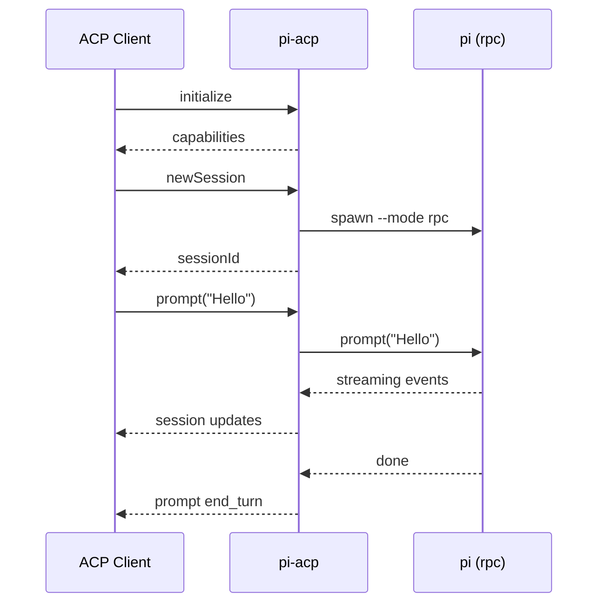

# pi-acp

> Agent Client Protocol (ACP) adapter for pi `--mode rpc`

[Agent Client Protocol](https://github.com/agentclientprotocol/sdk) (ACP) standardizes how agent clients and servers talk. This adapter bridges ACP clients (IDEs, UIs) to pi in RPC mode.

## Overview

- Spawn and manage pi sessions in RPC mode
- Translate ACP requests to pi RPC commands
- Stream output and tool calls back to the client
- Persist sessions across restarts

## Architecture

```mermaid
flowchart LR
  client[ACP Client\n(IDE, UI)] <--> adapter[pi-acp adapter\nNDJSON stdin/stdout]
  adapter --> pi[pi process\n--mode rpc]
```

## Message Flow



## Features

- Full ACP session lifecycle support
- Streaming responses and tool execution
- Multi-session persistence via `~/.pi/pi-acp/session-map.json`
- Slash command passthrough (`/compact`, `/model`, `/thinking`, etc.)

## Installation

```bash
cd pi-rpc-acp-adapter
npm install
```

## Usage

```bash
npm start
```

The adapter communicates over NDJSON (stdin/stdout). Any ACP client can pipe into it:

```bash
acp-client | node --import tsx src/index.ts | acp-client
```

## Zed Setup (Optional)

You can automatically inject the `pi-acp` provider into Zed’s settings:

```bash
npm run setup:zed
```

This updates the first settings file it finds at:

- `~/.config/zed/settings.json`
- `~/Library/Application Support/Zed/settings.json`

Manual snippet (if you prefer):

```json
{
  "assistant": {
    "providers": {
      "pi-acp": {
        "type": "custom",
        "command": "/path/to/pi-acp/node_modules/.bin/tsx",
        "args": ["/path/to/pi-acp/src/index.ts"],
        "env": {}
      }
    }
  }
}
```

## Development

```bash
npm run typecheck
npm test
```

## Troubleshooting

- Ensure pi is on your PATH: `which pi` / `pi --version`
- Adapter logs go to stderr; redirect for debug: `npm start 2>debug.log`

## License

MIT
